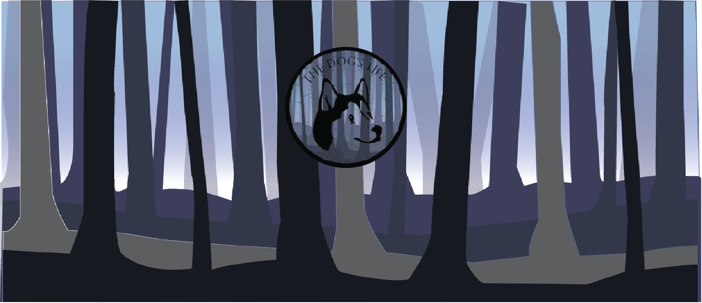

# GameDog
Game Development
# Run to Save

 # Samplle Video
 
 https://drive.google.com/file/d/1nop1UuXdW3fvvKF7G_960-qZWIb4DZEE/view?usp=sharing
 

# Project Description

  * This game design document describes the details of character 2D game actions and mechanics on how to play the game. This game concept is an original concept based the game functions control easily.
			
# Characters

 * Dog is the main character in this game, his named was Jerome. The dog was lost and he keep on running hoping to be found, The game also has enemy to kill the dog, the enemy which is the falling trees and Jerome trying to avoid falling trees to survived and this game aims to get highest score to proceed to the next level. 

# Story
 * There was a dog in the forest, hunting for food to survive the dog was alone and abandoned. The dog was scared due to the environment of no one is with him. The dog was named Jorome. When time has come Jerome experience struggle. There was a time the winds get angry and some of the trees are falling. Jerome runs away to escape the falling trees to survive. Jerom keep on barking to ask help and no one can hear him. The scenario was repeated every day.

# Theme
 * This game is about sadness and hardships. There are some scenarios that the main character struggles and facing obstacles but it keep on fighting for him to survive. When the time of sorrow the dog find ways to finish what he experience and he became a courageous dog. That’s why they called a dog act like human because of hardship.

# Game Play
 * This game is about sadness and hardships. There are some scenarios that the main character struggles and facing obstacles but it keep on fighting for him to survive. When the time of sorrow the dog find ways to finish what he experience and he became a courageous dog. That’s why they called a dog act like human because of hardship.

* •	Goal –  To help the dog to find owner
•	User Skills – Move arrow keys left to right shoot the bone which is the life and avoid enemies.
•	Progression on challenge – The difficulty of the game was the enemies fallen faster. The user must double time and active to avoid enemy (must play better).
•	Losing – These are the losing conditions: When the player out of control the dog was stop. Losing by running out of time and losing when getting hit by the falling trees. 

# Art Style
 * This is a 2D isometric game, with high quality of 2D sprite. The character design was cartoonize type of character. The character and background should be dark and badly mood with high animated scenarios and background.

# Music and Sounds

* •	The music sounds like nervous and tension that the player must feel excited to play.
  •	The falling enemies should have sounds when it touches the dog. For the user to know that the character hit by enemy.
  •	When the dog hit by the enemies, the sound must like out of lives.
  •	When the user play powerful and the dog was lively moving left to right.

# Technical Description
 * The game will be Mobile Cross platform: iOS, Android, Windows Phone, Personal Computer and Facebook Canvas.

•	Controls – Pressing arrow keys from left to right.
•	Fonts 

1.	Aller Light

2.	Euphemia

•	Audio / Music

1.	Characters

a)	Dog (moving left to right)

2.	Blocks

b)	Falling trees

3.	Ambient (Background)

c)	Abandoned Forest

4.	Other

d)	Bone

# Demographics

 * Age: 4 to 60, Sex: Everyone, Casual Player 

# Platforms & Monetization

 * Free android app with in-game ads, and paid version without ads. Free iOS with ads. Paid iOS version without ads. In game purchases. 

